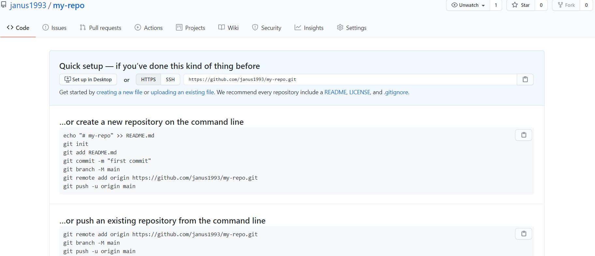
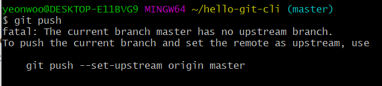
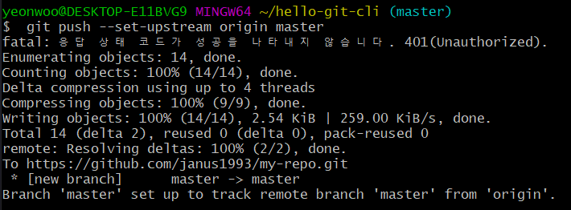

# 데이터 백업

## 수업의 목표와 용어 정리

> 백업을 위한 컴퓨터는 최소 2대  필요함,
>
> Local Repository(실제 작업을 하는 지역 저장소)와 
>
> Remote Repository(버전을 업로드해서 지역 저장소와 똑같은 상태를 유지)

두 컴퓨터를 연결해서 작업 끝날 때 마다 push를 통해 지역 저장소에서 원격 저장소로 업로드


1. Local Repository(집) 에서 작업
2. Remote Repository에 Push(백업)
3. Local Repository(회사) 에서 Remote Repository에 있는 데이터 Pull
4. Local Repository(회사) 에서 Remote Repository로 데이터 Push
5. 집에서 다시 Remote Repository에 있는 데이터 Pull

#### 이런 작업을 해주는 서비스가 Git hosting


# Git hosting

### git-hub & git-lab repository(저장소) 만들기

| git-hub                                                      | git-lab                                                      |
| ------------------------------------------------------------ | ------------------------------------------------------------ |
| 1. 회원가입<br />2. new repository<br />3. repository name 설정<br />4. private / public 설정 | 1. 회원가입<br />2. new project<br />3. project name 설정<br />4. private / public 설정 |


### 공부의 방향

|                                                        | Local -> Remote | Remote -> Local |
| ------------------------------------------------------ | --------------- | --------------- |
| **HTTP**<br />보안약함 <br />불편 <br />배울 필요 없음 |                 |                 |
| **SSH**<br />보안강력<br />편리<br />어려움            |                 |                 |

##### 우리는 HTTP 방식을 배운다(SSH는 시기상조, 때가되면 필요함을 느끼게 될 것)


### 원격 저장소와 연결

1. git hub 홈페이지 접속
2. Repository 들어감
   


**지역저장소, 원격저장소 연결**(지역저장소에 원격 저장소(들) 등록)

<code>git remote add[https로 시작하는 원격저장소주소]</code>

ex) git remote add https://github.com/janus1993/my-repo.git

매번 지역저장소 주소 외우기 힘들고, 지역저장소 대 원격저장소는 일대 다인 경우가 많음

따라서 쉽게 원격 저장소의 이름을 부를 수 있도록 원격 저장소의 별명을 지을 수 있음


<Code>git remote add 저장소별명 [https로 시작하는 원격저장소주소]</code>

저장소 별명은 origin이 기본 국룰

ex) git remote add origin https://github.com/janus1993/my-repo.git


##### 

<code> git remote</code> 현재 원격 저장소 목록 알랴줌

git remote -v</code> 현재 원격 저장소 목록과 주소 알랴줌


### git push

> <code> git remote add 별명 주소</code> 명령어를 통해 이미 원격 저장소와 연결이 되어있다. 그렇기 때문에 <code>git push</code> 명령어를 압력만 해주면 업로드가 가능하다.

> 다만 최초 1회 한정 다음과 같은 오류 메세지가 나올 수 있다.
>
> 
>
> 
>
> 
>
> 
>
> 

> 그대로(git push --set -upstream origin master) 입력하여 해결해주면 된다.
>
> **우리의 지역 저장소는 여러 원격저장소와 연결 될 수 있다. 그중에 어떤 원격저장소와 기본적으로 연결할 것인지를 묻는 것이다. **
>
> 그대로(git push --set -upstream origin master) 이다음부터 ''git push라관 입력하면 origin master라고 하는 브랜치로 업로드 되는 거다'' 라고 보면 됨.	

> #### 예상 외의 오류 (여러 git 아이디를 사용할 때 생기는 문제!)
>
> 원래 여기서 딱 봐도 성공한 듯한 화면이 나와야 하는데 나는 딱 봐도 에러가 났다는 화면이 떴다.
>
> ```cobol
> yeonwoo@DESKTOP-E11BVG9 MINGW64 ~/hello-git-cli (master)
> $  git push --set-upstream origin master
> remote: Permission to janus1993/my-repo.git denied to 2014126015.
> fatal: unable to access 'https://github.com/janus1993/my-repo.git/': The requested URL returned error: 403
> 
> ```
>
> 학교 과제용 git과 멀티캠퍼스용 git을 따로 사용해야해서 git 아이디를 두 개 사용하다보니 생긴 문제였다.  원격저장소 주소의 주인과 git bash 계정이 다르기 때문에 생긴 문제로 추정된다. 
>
> git 콘솔에서 user.name과 user.email을 변경하고 windows 자격증명을 받아 해결하였다(자세한건 아래 주소 참고).

해결법: https://somjang.tistory.com/entry/Git-Git-Bash-%ED%84%B0%EB%AF%B8%EB%84%90-%EA%B3%84%EC%A0%95-%EB%B3%80%EA%B2%BD-%EB%B0%A9%EB%B2%95

### 위 링크대로 진행하면 로그인 창이 뜬다

> 아이디 -> 비밀번호 순으로 입력하면 성공
>
> 성공시 아래 사진처럼 나온다. 
>
> (fatal: 응답 상태 코드가 성공을 나타내지 않습니다는 아이디 비번 한번 틀려서 그런거로 추정된다. 아니라면 언젠가 저거때문에 문제가 생길테니 그 때 다시 해결법을 찾기로 하고 넘어갔다)




> 여기까지 했다면 <code>git push</code> 를 다시 입력해보자(잘 작동한다)
>
> 자신의 git-hub Repository에서 새로고침을 통해 확인 가능
>
> 시계버튼 누르면 commit(버전)들 확인 가능


### <span style="color:red">차후과제(=미뤄둔 것)</span>

1. 외부저장소로 github와 gitlab을 동시에 진행하는 것
   - push 한번으로 양쪽에 commit 되게 할 수 있을까?
   - 안된다고 하더라도 하나의 지역저장소에서 여러 외부저장소 쓰는 법 익히기

### git clone(복제)

---

> 원격저장소에 있는 최신 버전의 프로젝트를 나의 현재 지역 저장소에 옮겨오는 것

1. init(최초로 저장소를 생성)
2. clone(이미 있는것을 가져오는 것)


init은 최초에 하는거니까 clone이 일반적인 복제의 이용이다.

#### git clone의 사용법을 .araboza

1. git 콘솔의 위치를 기존 지역저장소가 아닌 다른 디렉토리로 이동(cd와 mkdir 이용)
2. 명령어 입력: git clone 외부저장소주소 (또는 git clone 외부저장소주소 디렉토리명)
3. 현재콘솔위치/외부저장소이름의 디렉토리가 생성되며 복제된다.
   (git clone 외부저장소주소 디렉토리명으로 입력했다면 현재콘솔위치/디렉토리명 이름의 디렉토리가 생성되고 거기에 복제됨)


### git pull

---

git remote -v를 하면 현재 디렉토리가 연결되어있는 외부저장소 목록 나옴

git pull 하면 해당 외부저장소의 내용이 현재 디렉토리로 들어옴

<span style = "color:red">질문</span>

1. git pull을 외부저장소보다 최신버전인 로컬저장소에서 해버리면 내 로컬 저장소에서 해둔 작업은 소실되는가?

   ex) clone - 작업 - pull 을 했을 때

2. 


### Open source

---

1. [깃 홈페이지](git-scm.com)접속
2. 우측 하단 Source code 클릭
3. 압축파일 받아서 압축해제 또는 clone 사용


### 앞으로 공부할 만한 주제

git의 장점: 모든 저장소가 소스코드 뿐만 아니라 버전 정보도 갖고 있기 때문에 저장소 중 하나가 파괴되어도 나머지 저장소에서 모든 정보를 100% 복구 가능

---

- SSH - 매번 인증 물어보는거 빡치면
- issue tracker
- 백업을 통해 원격 저장소를 쓸 수 있다면 협업 준비가 된 것입니다.
- 충돌: 동일시간 - 동일 프로젝트 - 동일 파일 - 동일 행을 수정하는 상황 
- 버전관리시스템은 충돌으로인한 정보유실에 대한 대책이 마련되어있음
  이 부분에 대한 공부가 협업 시스템을 배우는 목적이라고 할 수 있다.

